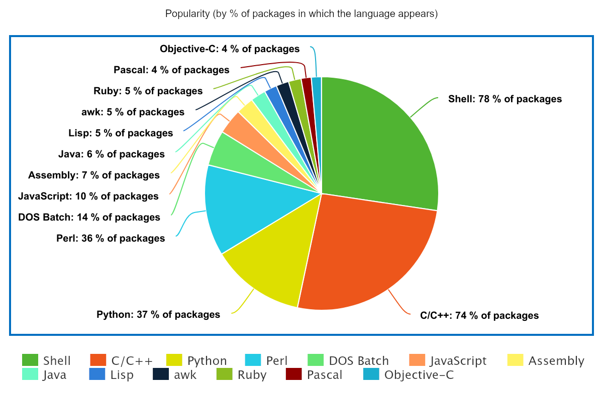

# "Real-world" Language Popularity Survey

## About

Many metrics exist to attempt to determine the relative popularity of different programming languages, including (for example):

- Developer opinion surveys
- Prevalence of languages on GitHub / similar sites
- Prevalence of languages mentioned in job listings
  etc.

These metrics each have their own inherent merits and flaws, of course. 

Here, we aim to get an idea of the prevalence of different programming languages in the real world. That is to say, we aim to discover the relative popularity of different programming languages *in practice*, as would be seen in different apps that are actually in use on consumer hardware.

## Methodology

A sample of **4,283** packages installed on an active **Debian Stable** computer was collected, and their sources obtained (**1,890** distinct source packages) via `apt source`. Each source package was then analyzed using [cloc](https://github.com/AlDanial/cloc) to determine *which* languages were used for each package, and in *what* proportion.

The data then obtained were then interpreted to determine **language popularity** in the following three ways:

- Portion of the total number of **lines of code** across *all* packages
  
  - This is equivalent to mixing up all of the source code of all of the packages into one big pot, and then determining what percentage of it is written in each language

- Percentage of the analyzed source-packages in which the given language *appears*

- Percentage of the analyzed source-packages in which the given language *is dominant* (has more lines of code than other languages in the same package)

The results are summarized in the graphs below.

## Results Summary

